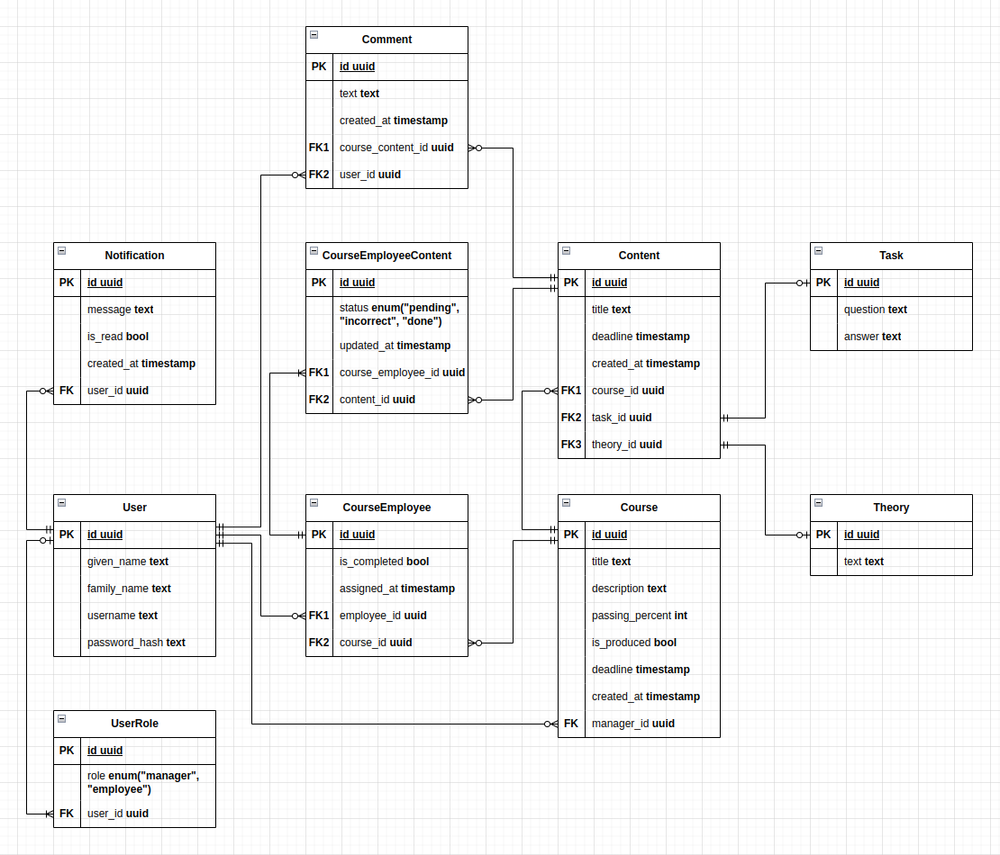

# ER-схема базы данных

<!--  -->

## Отношения между сущностями:

### 1. User <---> UserRole (One-to-Many)
- Один пользователь может иметь несколько ролей (например, "manager" или "employee"), при этом хотя бы одну.
- Одна роль принадлежит одному пользователю, либо не принадлежит никому.

### 2. User ↔ Course (One-to-Many)
- Один пользователь с ролью "manager" может создать несколько курсов, либо не создать ни одного.
- Один курс может быть создан обязательно одним и только одним пользователем с ролью "manager".

### 3. User <---> CourseEmployee <---> Course (Many-to-Many)
- Один пользователь с ролью "employee" может проходить несколько курсов, либо не проходить ни одного.
- Один курс могут проходить сразу несколько пользователей с ролью "employee", а может не проходить ни один.

### 4. Course <---> CourseContent (One-to-Many)
- Один курс может иметь несколько видов контента (задание или теория), либо вообще их не иметь.\
ВАЖНО: Курс НЕобязательно должен иметь какой-либо вид контента!
- Каждый вид контена обязательно связан с одним и только с одним курсом.

### 5. CourseContent <---> Task (One-to-One)
- Элемент контента может являться заданием.

### 6. CourseContent <---> Theory (One-to-One)
- Элемент контента может являться теорией.

### 7. CourseContent <---> Comment (One-to-Many)
- Один элемент контента может иметь несколько комментариев, либо вообще их не иметь.
- Каждый комментарий обязательно относится к одному и только одному элементу контента.

### 8. User <---> Comment (One-to-Many)
- Один пользователь может оставить несколько комментариев, либо не оставлять их вообще.
- Каждый комментарий обязательно написан одним и только одинм пользователем.

---

## Бизнес-логика, относящаяся к базе данных:

### 1. Пользователь:
- Пользователь должен иметь хотя бы одну роль (например, "manager" или "employee").
- Если пользователь имеет роль "manager", то он может создавать (новые) курсы и добавлять задания для своих созданных курсов (но добавлять задания для курсов, которые создал другой пользователь он не может). При этом пользователь с ролью "manager" не может регистрироваться на курсы (это могут делать только пользователи с ролью "employee") и выполнять задания курсов (это могут делать только пользователи с ролью "employee").
- Если пользователь имеет роль "employee", то он не может создавать курсы (это могут делать только пользователи с ролью "manager") и добавлять задания для курсов (это могут делать только пользователи с ролью "manager"). При этом пользователь с ролью "employee" может регистрироваться на курсы и выполнять задания курсов, на которые он зарегистрирован.
- Вне зависимости от роли, пользователь может добавлять комментарии к элементам контента курса (теории или заданию).

### 2. Курс:
- Курс может быть создан только пользователем с ролью "manager".
- Курс может проходить только пользователь с ролью "employee".
- Курс может иметь элемент контента (теория или задание). ВАЖНО: Курс НЕобязательно должен иметь контент!

### 3. Элемент контента:
- Добавлять элемент контента к курсу может только создатель этого курса (и как следствие, только пользователь с ролью "manager").
- Если в записи в таблице CourseContent поле content_type имеет значение "task", то поле task_id обязательно должно быть заполнено, а поле theory_id обязательно должно быть пустым. Аналогичные рассуждения верны для случая, когда поле content_type имеет значение "theory". Не допускается случаи, когда в одной записи в таблице CourseContent оба поля task_id и theory_id заполнены. Точно также не допускается случаи, когда в одной записи в таблице CourseContent оба поля task_id и theory_id являются пустыми.

### 4. Теория:
- Одна запись в таблице Theory может быть связана только с одной записью в таблице CourseContent.

### 5. Задание:
- Одна запись в таблице Task может быть связана только с одной записью в таблице CourseContent.
